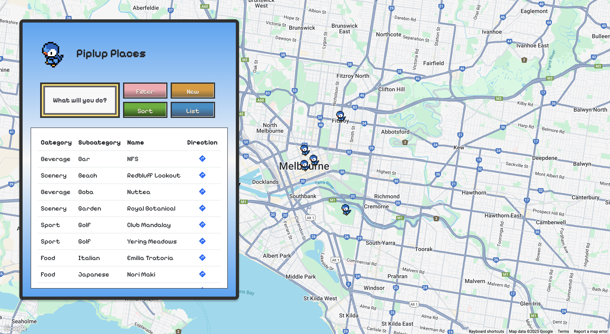

# Piplup Places

Piplup Places is a pixel-themed web application for managing locations around Melbourne (or any other city). The system is built using CakePHP, Bootstrap, and Google Maps API.

---

## Features

- Interactive Google Map with custom pixel markers
- Add, view, filter, and sort places by Category and Subcategory
- Group subcategories by their parent categories using an accordion layout
- Flexible filter system with dynamic subcategory loading based on selected categories
- Smooth hover and transition effects consistent with a pixelated design theme
- Custom-styled error pages (404 and 500) with pixel art
- Responsive layout for desktop and mobile devices

---

## How to Add a New Place

1. Navigate to the "Places" page.
2. Click on the "New" button.
3. Fill in the form:
   - Select a Category.
   - Choose a Subcategory (filtered automatically based on selected Category).
   - Enter the Place Name.
   - Start typing the address and select from Google Maps Autocomplete suggestions.
   - Optionally add a Description.
4. Submit the form to save the new place.

---

## How to Add a New Category

1. Go to the "New Menu".
2. Select "New Category".
3. Enter the category name.
4. Submit the form.

---

## How to Add a New Subcategory

1. Go to the "New Menu".
2. Select "New Subcategory".
3. Select an existing Category.
4. Enter the Subcategory name.
5. Submit the form.

Note: Subcategories must be linked to a Category.

---

## How to Filter Places

1. Click the "Filter" button on the Places page.
2. In the filter popup:
   - Select one or multiple Categories.
   - Based on the Categories selected, related Subcategories will dynamically appear.
   - Optionally select Subcategories.
3. Click "Apply Filter" to update the list and map view.

---

## How to Sort Places

1. Click the "Sort" button.
2. Choose one of the available sorting options:
   - Category (A-Z)
   - Subcategory (A-Z)
   - Name (A-Z)
   - Name (Z-A)
3. The list will automatically sort based on the selected criteria.

---

## Subcategories Display

- Subcategories are grouped under their respective Categories in an accordion layout.
- Clicking on a Category expands its Subcategories, showing:
  - Subcategory Name
  - Creation Date
  - Modification Date
  - Action links (Edit, Delete)
- Smooth accordion transitions and hover border effects are implemented for consistency.

---

## Map Interaction

- Clicking a Place in the list pans and zooms the map to its marker.
- Only one info window (popup) is open at a time to keep the map clean.
- Custom map markers are used (Piplup pixel icon).

---

## Technical Setup

- CakePHP 5.1.6
- PHP 5.2.2
- Bootstrap 5.3
- Google Maps JavaScript API and Places API enabled
- Database structure:
  - Categories table
  - Subcategories table (linked to Categories)
  - Places table (linked to Subcategories)

Google Maps API Key is required and should have the necessary APIs enabled.

---

## Development Notes

- Filtering and Sorting are handled server-side through CakePHP Paginator.
- Place address fields use Google Maps Autocomplete for faster and more accurate data entry.
- The application uses a pixel font theme (`Pixelify Sans`) and retro color schemes for styling consistency.
- The system is designed to be lightweight with minimal external dependencies.

